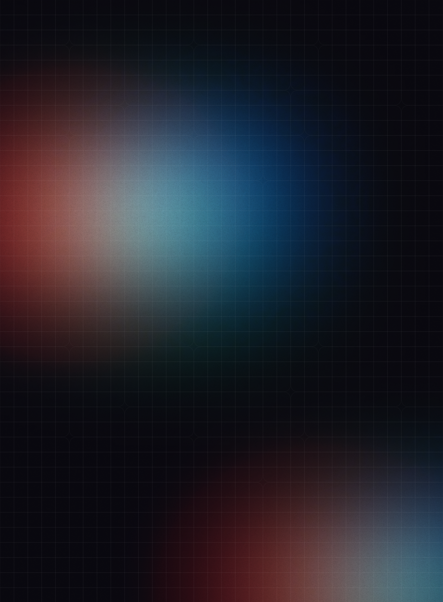

  

<h1 align="center">
  Hello there, I'm Gabriella
  
</h1>

  

  
  
  

  

<!-- 

 -->

- Graduated at [Laboratoria's](https://github.com/Laboratoria) Bootcamp 
- You can find my projects in: [gabriella.guimarães.net.br](https://github.com/gabriella-guimaraes)
- Contact: **gabriellaguimaraes01@outlook.com**
- Don't be a stranger! Let's talk about technology anytime 💬

---
## 🛠 Tech Stack

#### 🔧 Languages

      

#### 🖥️ Frameworks

       

#### 📚 Libraries

     

#### 🔧 Tools

           

### 📊 Profile Statistics

 

  

  

---
